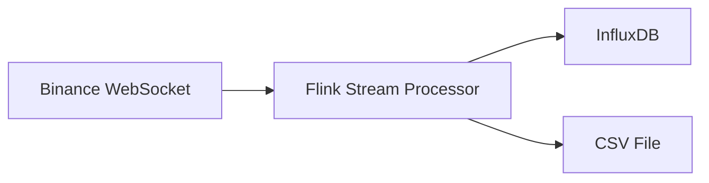
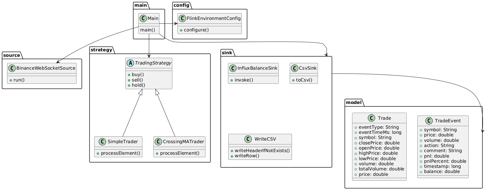
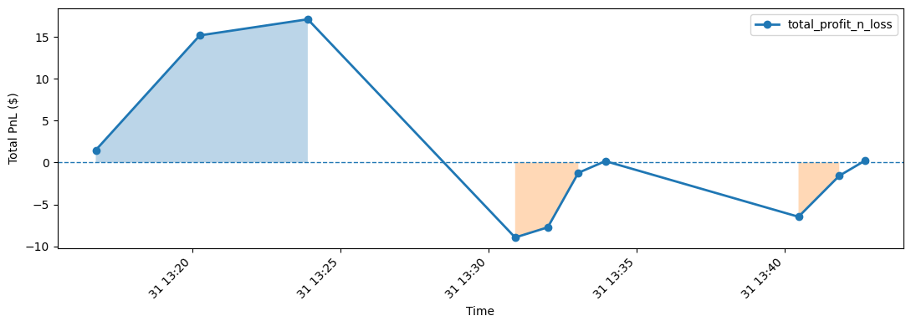
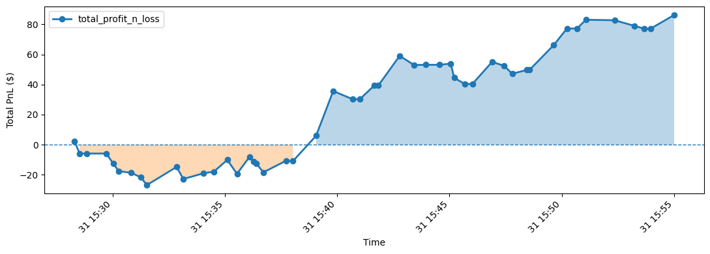

# CryptoTrader

### Introduction
Project builds a simple crypto trader working based on streaming data obtained from binance using Apache Flink. 
Crypto currency prices are collected from a 24h moving average miniTicker (not real market values) for convenience, 
but this could easily be changed. Trading decisions are made based on rules defined in strategies. Core data, including current balance and
trades made is being sinked to InfluxDB or a CSV file

**What is Apache Flink** \
Apache Flink is an open-source, distributed data processing framework designed for high-throughput, 
low-latency applications. It runs on clusters and processes data in parallel, 
handling failures automatically with state management and checkpointing. Flink’s core strength is stream processing.
Unlike batch-first systems, Flink treats streams as the primary data model

### Data Flow



**Strategies available** 

_SimpleTrader_:
Based only on moving average of n steps. Enters a trade when value goes under average by some threshold: `trade.getClosePrice() < movingAvg * (1 - threshold)`, exits when value raises above the average.

_CrossingMATrader_:  More sophisticated, uses 2 MAs; fastMA (few steps back) and slowMA (many steps back). Trader enters a trade
when fastMA goes above slowMA (bullish cross), exits when fastMA goes below slowMA. Optional volume check is available
(only enter when volume is higher than average by some threshold). Trader also utilized stop loss and take profit (auto sell after significant drop or raise).


### File structure

### Prerequisites
- java 17
- maven
- .env file (with missing values filled):
```bash
INFLUXDB_URL=http://influxdb:8086
OUTPUT_FILE_PATH=/data/output.csv
RUNNING_MODE=db # or csv
STRATEGY=crossing_ma # or simple
symbol=btcusdt

# InfluxDB 2.x bootstrap
DOCKER_INFLUXDB_INIT_MODE=setup
DOCKER_INFLUXDB_INIT_USERNAME=... # example admin
DOCKER_INFLUXDB_INIT_PASSWORD=... # example pwd
DOCKER_INFLUXDB_INIT_ORG=trading 
DOCKER_INFLUXDB_INIT_BUCKET=trading_db
DOCKER_INFLUXDB_INIT_ADMIN_TOKEN=... # example secret-token
```

### How to run:
- `mvn clean package`
- `docker compose up -d`
- `docker exec -it $(docker ps | grep jobmanager | awk '{ print $1 }') flink run /opt/flink/job.jar`

Or run `./start.sh`

### How to observe app working
- Program logs available in container: `docker logs -f cryptotrader-taskmanager`
- If using CSV mode, values are sinked to location defined in OUTPUT_FILE_PATH environment variable in cryptotrader-taskmanager container, to print them one can run `docker exec -it cryptotrader-taskmanager cat "data/output.csv"`
- If using DB mode, access InfluxDB UI at `localhost:8086`

### Results

1. Trading Profit & Loss 
#### _SimpleTrader:_ 
 
#### _CrossingMATrader:_ 

2. Latency
3. ???
